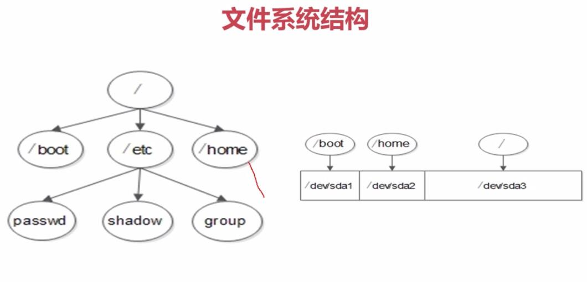

# 第一章 系统安装 VMware 创建虚拟机

* 创建虚拟机(标准安装)

> 高级安装和标准安装差不多，这里没有深究

* 选择新的硬盘

> 选择创建一个新的硬盘，不要直接安装镜像，安装镜像的是简化安装

* 卸载以前安装的VMware

> 百度一个VMware_install_cleaner,可以快速卸载残留

* 选择磁盘容量

> 这里选不选没关系，一般只需3-4个G,磁盘是根据你文件的大小来定的

***
# 安装centOs

*  网络适配器

    桥接:采用真实机的网卡,但是要占用局域网的ip,可上网
    NAT模式：采用虚拟出来的VMnet8 这个网卡，可上网
    仅主机模式：采用虚拟出来的VMnet1 这个网卡，不能上网

> 小技巧
>>  善于应用快照
>
>>  虚拟机>管理>克隆
>
>>这个可以复制当前的系统。注意链接克隆和完整克隆。链接克隆的特点是占少量的空间就可以完成和目标主机一样的功能，缺点就是删除目标主机后，他的功能也就消失了。完整克隆就是在复制了一份。缺点：比较耗费硬盘，优点是，自成一体，不随着目标主机的删除而消失

* 系统分区

    主分区:最多只能有4个。硬盘的结构决定的。硬盘被分成了一个一个等大小的扇区，每个扇区是512字节, 其中的一个扇区是主引导扇区，其中446扇区启动信息，剩下的64个扇区记录分区信息，每16个字节可以记录一个扇区，所以就可以分4个
    扩展分区：
      1.最多只能有一个
      2.主分区加扩展分区最多有4个
      3.不能写入数据，只能包含逻辑分区
    逻辑分区：

    格式化：根本目的是为了写入文件系统。又称逻辑格式化，他是根据用户的选定的文件系统，在磁盘的特定区域写入特定的数据，在分区的划出一片用于存放文件分配表、目录表等文件管理的磁盘空间。

### 文件系统 越新的文件系统越先进
* FAT16：最大支持2GB的分区
* FAT32: 单个文件大小不能超过4个G,分区16TB
* NTFS:window 最先进的文件系统,
* EXT2:linux
* EXT3:linux
* EXT4:linux centos 6.3中使用

### 格式化的目的
* 把我们的分区搞成等大小的数据块(block)，默认是4KB
* 分区列表里面建立了I节点，里面记录文件的名字、权限、修改时间、block的id

### 硬件设备文件名,linux一切皆文件
* IDE硬盘:/dev/hd[a-d]
* SCSI/SATA/USB硬盘:/dev/sd[a-p]
* 光驱:/dev/cdrom 或者 /dev/hdc
* 软盘:/dev/fd[0-1]
* 打印机(25针):/dev/lp[0-2]
* 打印机(USB):/dev/usb/lp[0-15]
* 鼠标:/dev/mouse

### 设备文件名
* /dev/hda1 (IDE硬盘接口) 理论速度133M/s 针孔
* /dev/sda1 (SCSI硬盘接口200M/s或者SATA的硬盘接口500M/s)

> 上面的a代表第一块硬盘，b就是第二个硬盘 1代表第一个分区.SCSI的接口就是想小时候玩游戏的卡一样，SATA的是红色的那种

### 挂载
> 必须分区
>> 根分区 /
>
>> swap分区 交换分区，内存2倍，不超过2GB,虚拟内存，生产环境:
> 内存小于4G,分的大小是内存的2倍，大于4个G，保持和内存一样就行了，我们在实验环节，所以不超过2G就ok
>
>> 推荐分区 boot 启动分区 200MB

